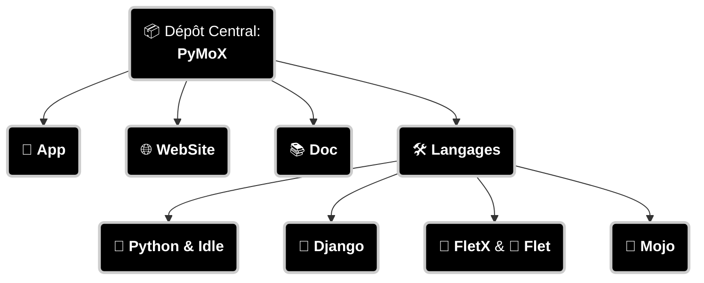

# 🧭 Projet Central – Portail des Dépôts

Bienvenue dans le Dépôt Officiel et Central de l'écosystème **PyMoX**-fr, pour des études et projets liés aux langages tels que **Py**thon, Django, **Mo**jo, Flet et Flet**X** (Liste non exhaustive...).

Ce Dépôt Central regroupe les dépôts indépendants liés à ces sujets, ainsi que ce projet lui-même, entièrement open-source (sous licence MIT), composé principalement de son application mobile, de son site web et d’une documentation collaborative.

Ce dépôt sert donc de point d’entrée pour explorer les différents modules, outils, et développemnts dans ces domaines. Il agit comme un hub de navigation pour l’ensemble des composants du projet PyMoX.

<div style="text-align:center; font-size:24px">
  <a href="http://pymox-fr.github.io" target="_blank" rel="noopener">Voir la Doc</a>
</div>

## 📦 Dépôts liés



Cette structure traduit aussi la structure des dossiers.

### 🧰 Scripts de gestion des sous-modules

Ce dépôt central **PyMoX** utilise des **sous-modules Git** pour organiser ses composants (App, WebSite, Doc, Langages…).  
Pour faciliter leur gestion, deux scripts sont fournis :

---

#### 🔹 `init-submodules.sh` – Initialisation

Juste après avoir cloné ce dépôt central, exécuter dans le dossier **PyMox/** :

```bash
sh ./t/init-submodules.sh
```

📦 Ce script initialise tous les sous-modules et télécharge leur contenu localement.

→ Cela va **clôner TOUS les dépôts liés** en tant que sous-modules.

---

#### 🔹 `update-submodules.sh` – Mise à jour

À exécuter régulièrement pour **synchroniser les sous-modules** avec leurs dernières versions distantes :

```bash
sh ./t/update-submodules.sh
```

🔄 Ce script met à jour les références des sous-modules vers les derniers commits disponibles dans leurs dépôts respectifs.

#### 🛠️ Astuce technique

Avant de pouvoir exécuter les scripts, si sous **Linux**, assurez-vous qu’ils soient bien exécutables:

```bash
chmod +x t/init-submodules.sh t/update-submodules.sh
```

## 🔍 Objectifs

- Centraliser les ressources
- Faciliter la navigation entre les projets
- Offrir une vue d’ensemble cohérente

---

## 🤝 Contributions

Chaque dépôt est ouvert aux suggestions, améliorations et retours. N’hésite pas à ouvrir une issue ou proposer une pull request dans le dépôt concerné.

---

## 📬 Contact

📬 Pour toute question ou discussion, rejoignez-nous sur [Discord – PyMoX](https://discord.com/channels/1395436334507626566/1395436335103213571)

# 2fix just for test

# 2dbug just for test

# 2ar just for test

# * [/] just for test

# * [ ] just for test

# 2do just for test

# 2see just for test

# 2let just for test
