# Prêt ?

```mermaid
  flowchart BT
    subgraph PX[PyMoX]
      direction LR
      A((Départ
       💻))--->B([Étapes
 🔧])--->C(Arrivée
😁)
    end
    PX-.->E[(↑ Souvenirs)]
    PX==>D[(↑ **Expérience**)]
```

  <table>
    <thead>
      <tr>
        <th>Code</th>
        <th>Icône</th>
      </tr>
    </thead>
    <tbody>
      <tr>
        <td><code>:computer:</code></td>
        <td class="big-droite">💻</td>
      </tr>
      <tr>
        <td><code>:keyboard:</code></td>
        <td style="font-size:18px; text-align:left">⌨️</td>
      </tr>
      <tr>
        <td><code>:wrench:</code></td>
        <td class="big-droite">🔧</td>
      </tr>
    </tbody>
  </table>

